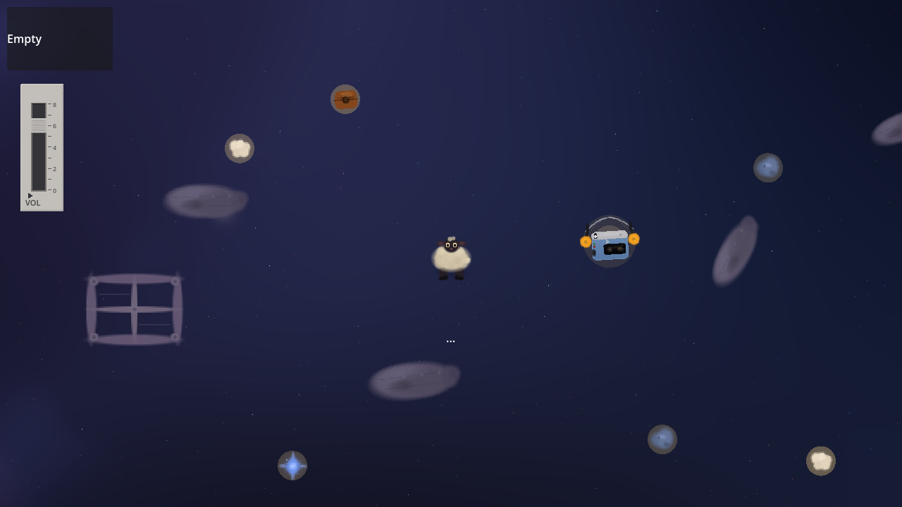

# Ashes of the Meadow

A lonely sheep drifts through the ruins of space, carried forward by music.



## Mega Sheep Minigame

A retro arcade side-scroller where a rocket-powered sheep in a spacesuit dodges meteors, collects power-ups, and battles a twisted baobab tree boss with CRT monitors growing from its branches.

### Controls

- **A / D** or **Arrow Keys** — Move up/down
- **SPACE** — Charge and fire sound waves
- **ESC** — Quit

### Features

- Procedural FM synthesis audio — no audio files needed
- Boss fight with multiple attack phases (barbed wire, TVs, spiral patterns)
- Power-ups: shields, magnets, slow-mo, golden stars
- Little Prince-themed collectibles (roses, foxes, tiny planets)
- Smooth movement with acceleration, near-miss bullet time, screen shake
- CRT scanlines, twinkling stars, particle effects

### Standalone Build

A standalone Windows build of just the minigame can be exported:
```
./godot_engine/Godot_v4.6.1-stable_win64.exe --headless --export-release "Windows Desktop" build/MegaSheep.exe
```

## Main Game

### Controls

- **A / D** or **Arrow Keys** — Aim direction
- **SPACE** — Hold to charge a bass pulse, release to propel forward
- **E** — Interact with objects

## Credits

- **Author of the concept:** @AnnSerafima
- **Developer:** VFilitovich

## Engine

Built with [Godot 4.6](https://godotengine.org/).
